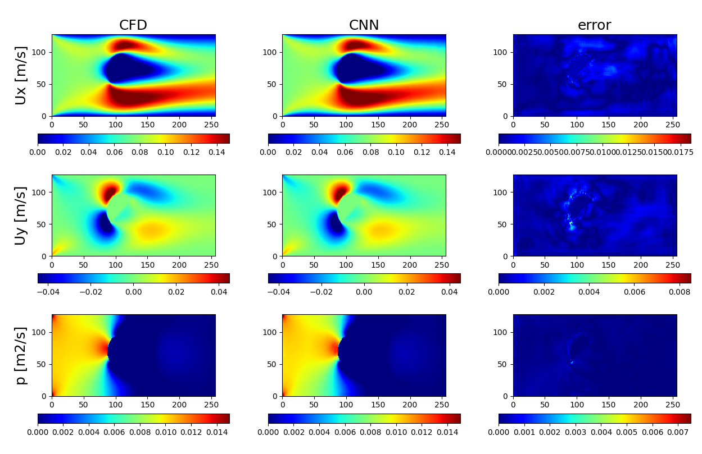
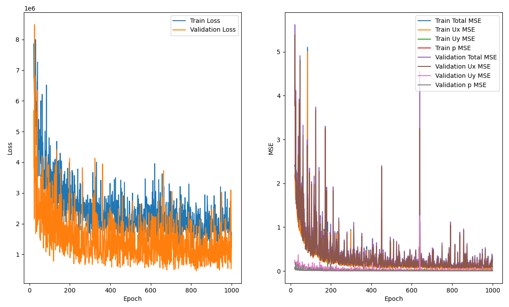

# flowAroundObstacles

Workflow for solving the flow around different obstacles using simpleFoam. This case
is adapted from the example described by Mateus Dias Ribeiro and collaborators in
[DeepCFD](https://github.com/mdribeiro/DeepCFD) and the [paper](https://arxiv.org/abs/2004.08826).

Usage:

```
./Allrun ${cores}

e.g.:

./Allrun 30
```

The output of the worflow is the ONNX model at DeepCFD/flowAroundObstacles.onnx.

You can test its use at https://play.simzero.com/#D3SFTH#7.

## Case


## OpenFOAM vs DeepCFD



## Curves


